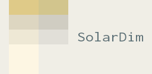
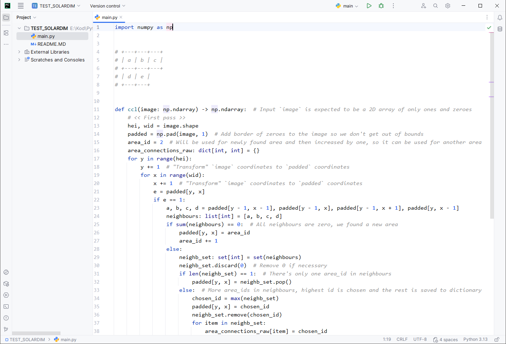
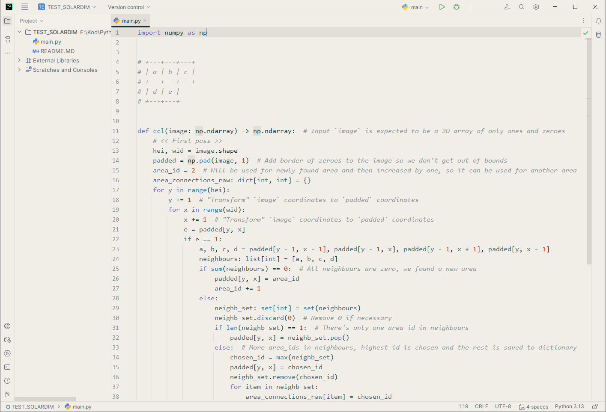
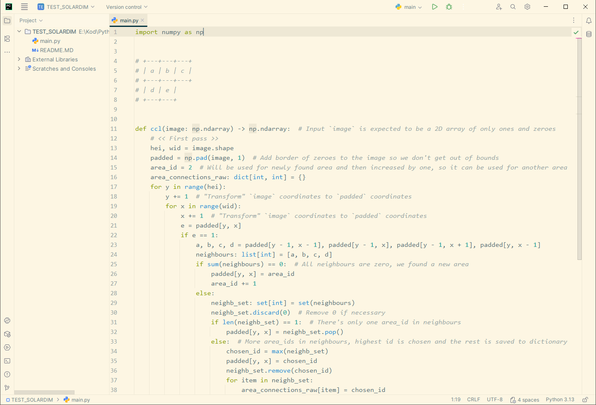

# SolarDim color theme for JetBrains IDEs

[← Back to parent repository](https://github.com/RDMCz/SolarDim)

* [What is this](#what-is-this)
* [Showcase](#showcase)
* [Installation](#installation)
* [Legal](#legal)
* [Running locally](#running-locally)
* [Changelog, TODO, known issues](#changelog-todo-known-issues)

## What is this

SolarDim is an IDE color theme that aims to strike a balance between typical _light_ and _solarized light_ IDE color themes. It is based around the color `#F0EEE6`: the "Light grayish yellow".

The pure white background of light color themes can be too straining on the eyes, while the colors of solarized light color themes can be too warm, especially if you use a software night screen filter or wear computer glasses. If you found out that you can navigate the code better when using a light theme, but the themes mentioned above are too white or yellow for you, you might want to give SolarDim a try.

SolarDim initially started as a color theme for VS Code, which is a fork/edit of _vscode-better-solarized_ by _edheltzel_. This particular SolarDim port is a fork/edit of _solarized_ by _espositocode_. For more info see the [Legal section](#legal).

## Showcase

Light|SolarDim|Solarized Light
---|---|---
||

## Installation

* [JAR Plugin file](https://github.com/RDMCz/SolarDim-JetBrains/releases)
* JetBrains Marketplace __TBP__

SolarDim is also available for [VS Code](https://github.com/RDMCz/SolarDim-VSCode).

 

To install JAR Plugins in JetBrains IDEs:

1. Go to `File` → `Settings...` → `Plugins`
2. In _Plugins window_, click the little cogwheel icon and select `Install Plugin from Disk...`
3. Navigate to downloaded JAR file and click _Open_
4. Click _Ok_ in _Plugins window_

## Legal

SolarDim wouldn't be possible without _vscode-better-solarized_ by _edheltzel_, for more info, see the [Legal section of SolarDim for VS Code](https://github.com/RDMCz/SolarDim-VSCode?tab=readme-ov-file#legal). This project is a edit of [solarized](https://github.com/subtheme-dev/solarized) ([MIT](https://github.com/subtheme-dev/solarized/blob/master/LICENSE)) by [Jonathan Esposito (espositocode)](https://github.com/espositocode), who did a great job getting Solarized onto a platform where, in my opinion, the developer experience of creating color themes is not the best.

This project is also licensed under the [MIT license](./LICENSE).

## Running locally

JetBrains provides a ["tutorial"](https://plugins.jetbrains.com/docs/intellij/themes-getting-started.html) on creating color themes, but it is not very comprehensive. Testing color theme via the _IDE Development Instance_ isn't working for me properly and same goes for the _Preview Theme_ feature. So, unfortunately, the only 100% functional method is to compile the color theme into a plugin and install it:

* Edit values (in any text editor, requires Python):
  * Edit values in `./src/colors.json`, `./src/scheme.xml`, and `./src/SolarDim.theme.json` to your liking
  * Run `./src/build.py`
    * This script takes color definitions from `./src/colors.json` and inserts them into files `./src/scheme.xml` & `./src/SolarDim.theme.json`, which it then copies to actual color theme project `./SolarDim/*`

* Create JAR (requires IntelliJ IDEA):
  * Open `./SolarDim` in IntelliJ IDEA with [_Plugin DevKit_](https://plugins.jetbrains.com/plugin/22851-plugin-devkit) installed
  * Select `Build` → `Prepare Plugin Module 'SolarDim' For Deployment`
    * `SolarDim.jar` will be generated in `./SolarDim`

* Install JAR (in any JetBrains IDE):
  * Select `File` → `Settings...` → `Plugins`
  * In _Plugins window_, click the little cogwheel icon and select `Install Plugin from Disk...`
  * Choose `SolarDim.jar`
  * Restart your IDE

## Changelog, TODO, known issues

* [Changelog](./_markdown/Changelog.MD)

* [TODO, known issues](./_markdown/TODO.MD)
